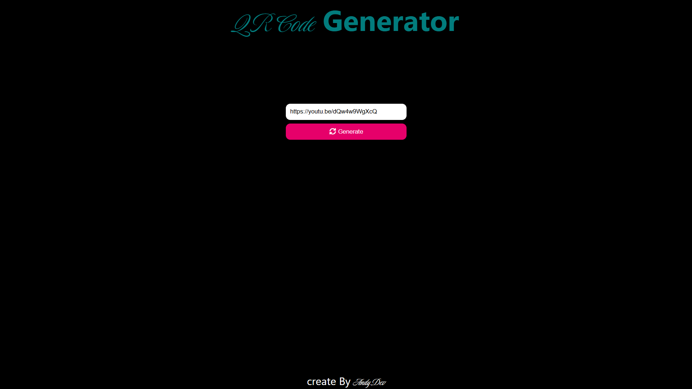
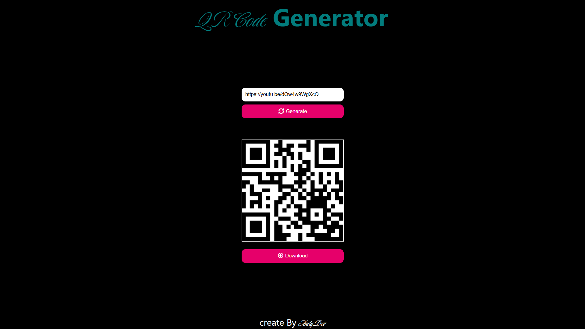

# QR Code
Esta  es una web sencilla que transforma cadenas de texto y URLs y las convierte en codigos QR, a traves de la API de *api.qrserver.com*. Esto como solucion personal, a otras webs que solicitan inicio de sesión, ponen limites de tiempo y cobros por generar un QR Code.

## Uso

Ingrese a la web *iamandydev.github.io/qr-code/*, ingrese su URL en el campo de texto y de click al botón 'generar'.

Inmetiatamente aparecerá debajo el QR Code generado, junto con el botón de descarga.